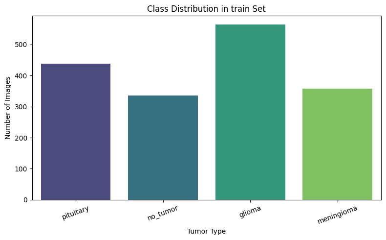
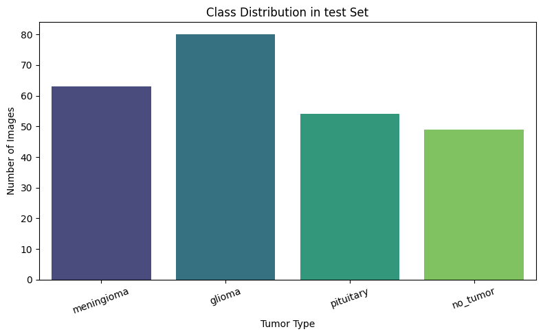
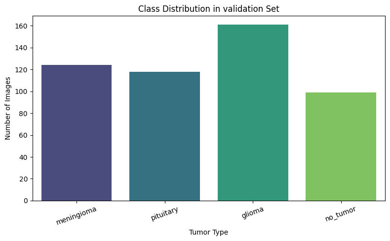
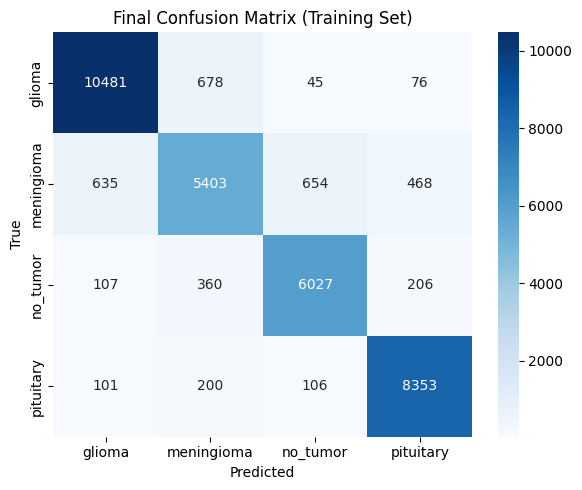

# 🧠 Brain Tumor MRI Classification

[](https://huggingface.co/spaces/PavanKumarD/Brain-Tumor-classification)
[](https://braintumer.streamlit.app)
[]

---

## 📌 **Project Overview**
Brain tumors are life-threatening conditions that require **early detection** and **precise diagnosis**. This project leverages **Deep Learning** techniques to classify brain MRI images into **4 categories**:
- **Glioma**
- **Meningioma**
- **Pituitary**
- **No Tumor**

The solution combines a **custom-built CNN** (Convolutional Neural Network) and **transfer learning (DenseNet121)** to achieve high classification accuracy. A **Streamlit app** is deployed for real-time inference, allowing users to upload MRI scans and get instant predictions.

---

## 🎯 **Key Features**
- **Accurate Classification:** Identifies MRI scans into 4 classes with high accuracy.
- **Custom CNN & Transfer Learning:** Evaluated both approaches and chose the best-performing model.
- **User-Friendly Interface:** Built a Streamlit app for drag-and-drop image uploads.
- **Deployed Model on Hugging Face:** Accessible via API and Hugging Face Spaces.
- **Visualization:** Includes class distributions, confusion matrix, and accuracy/loss trends.

---

## 🚀 **Tech Stack**
- **Programming Language:** Python
- **Frameworks:** PyTorch, Torchvision, Streamlit
- **Modeling:** Custom CNN, DenseNet121 (Transfer Learning)
- **Data Visualization:** Matplotlib, Seaborn
- **Deployment:** Hugging Face Spaces, Streamlit

---

## 📊 **Dataset**
- **Total Images:** 2,443
- **Split:**  
  - **Train:** 1,695 images  
  - **Validation:** 502 images  
  - **Test:** 246 images
- **Classes:** `glioma`, `meningioma`, `pituitary`, `no_tumor`
- All images were normalized and resized to **128x128** pixels for model training.

---

## 🔥 **Model Performance**
| Model            | Accuracy | Precision | Recall | F1-score |
|------------------|----------|-----------|--------|----------|
| **ResNet18**     | 73%      | 0.72      | 0.73   | 0.72     |
| **DenseNet121**  | 70%      | 0.70      | 0.70   | 0.69     |
| **Custom CNN**   | **89%**  | **0.89**  | **0.89** | **0.89** |

> **Custom CNN** outperformed all transfer learning models due to tailored architecture for grayscale MRI images.

---

## 🖼 **Visualizations**
### Class Distribution




### Confusion Matrix (Custom CNN)


---

## ⚙️ **How to Run Locally**
### 1. Clone this repository:
```bash
git clone https://github.com/Pavan-Kumar-Dirisala/Brain-Tumor-Classification.git
cd Brain-Tumor-Classification
````

### 2. Install dependencies:

```bash
pip install -r requirements.txt
```

### 3. Run the Streamlit app:

```bash
streamlit run app.py
```

---

## 🌐 **Live Demo**

🚀 **Streamlit App:** [Click here to try](https://braintumer.streamlit.app)

---

## 📂 **Project Structure**

```
Brain-Tumor-Classification/
│
├── train/                # Training dataset
├── valid/                # Validation dataset
├── test/                 # Testing dataset
├── models/               # Saved model files
├── app.py                # Streamlit app
├── requirements.txt      # Dependencies
├── README.md             # Project documentation
└── utils/                # Helper functions
```

---


## 👨‍💻 **Author**

**Pavan Kumar Dirisala**
[GitHub](https://github.com/Pavan-Kumar-Dirisala) | [Portfolio](https://pavan-kumar-dirisala.github.io/Portfolio/) | [LinkedIn](https://www.linkedin.com/in/pavan-kumar-dirisala-523611281/)


```
